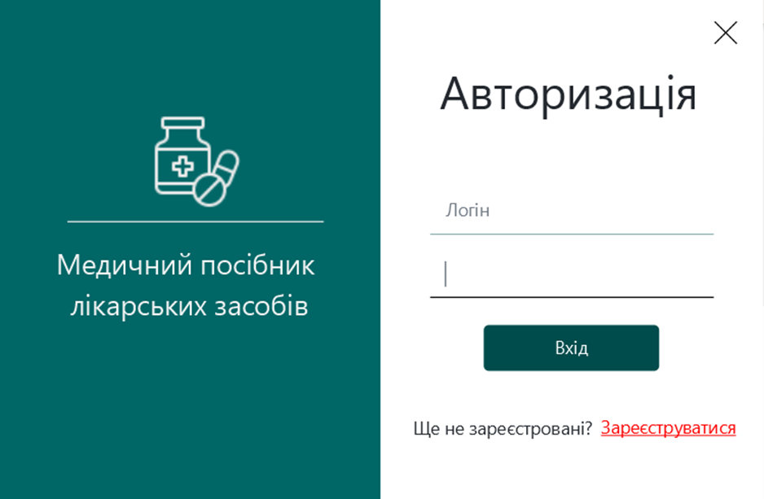
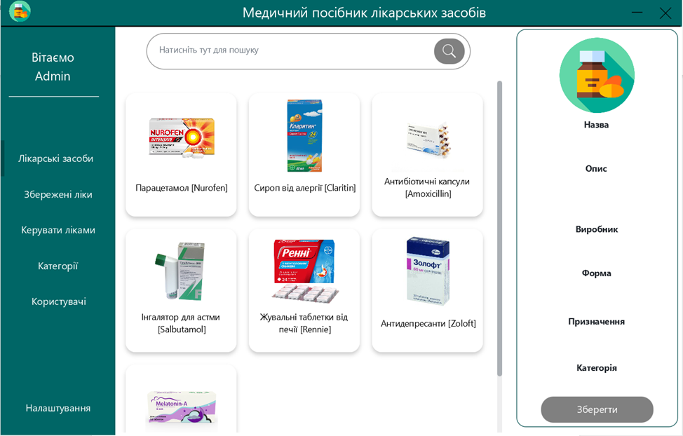
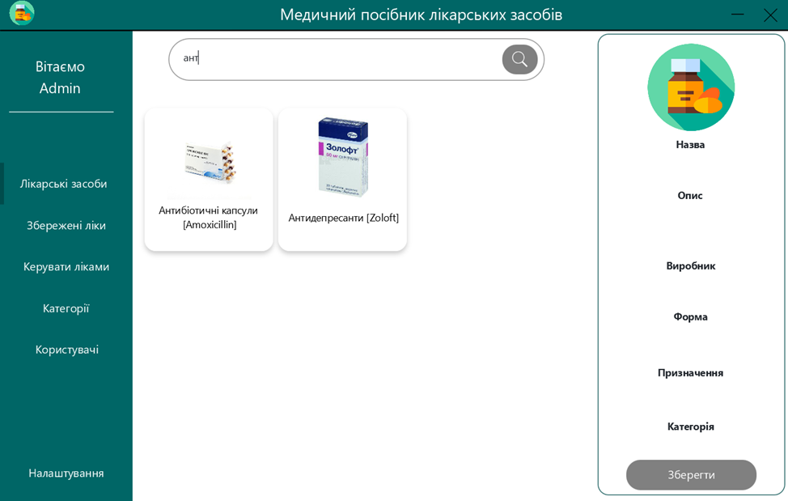
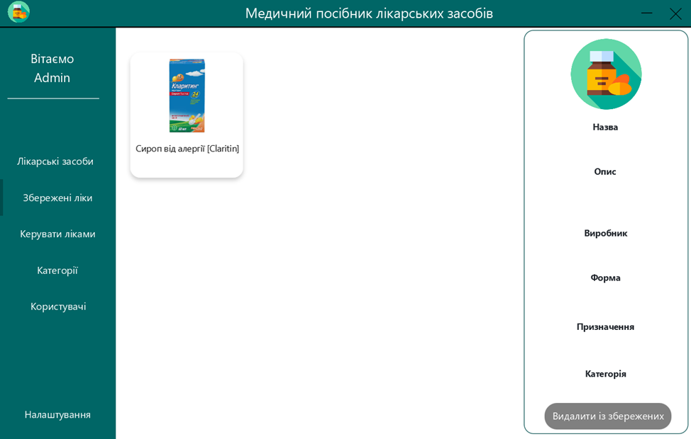
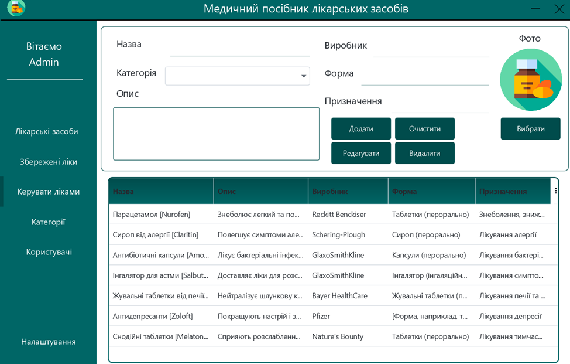
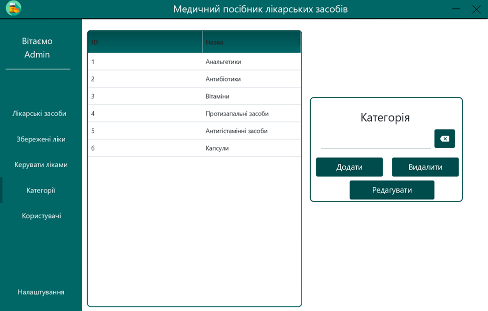
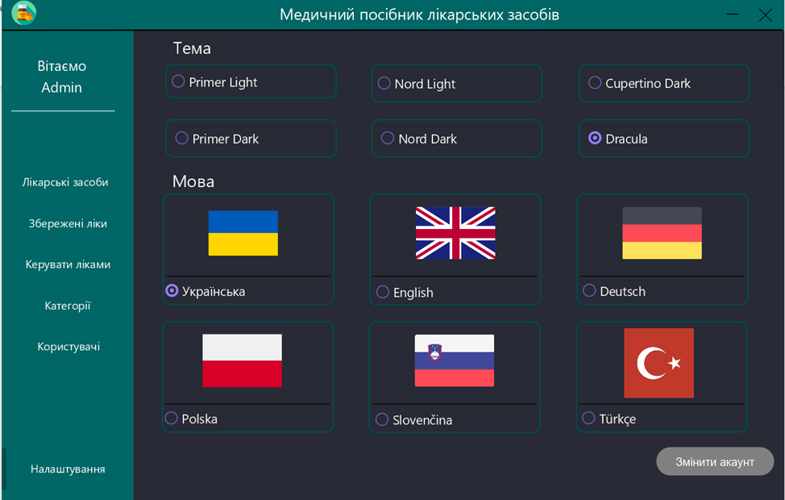

<h1 align="center">🏥 Медичний Посібник Лікарських Засобів</h1>

## Опис

> Цей проєкт представляє собою JavaFX-додаток для керування інформацією про лікарські засоби. Він дозволяє користувачам працювати з ліками: додавати нові, редагувати, видаляти, зберігати та шукати інформацію.
## 🚀 Можливості
#### Звичайний користувач
- ✨ **Перегляд та збереження**: Переглядайте ліки та, за потреби, додавайте у збережні.
- ✨ **Пошук**: Здійснюйте пошук ліків. 
- ✨ **Налаштування**: Змінюйте мову, тему чи акаунт у налаштуваннях.
#### Адмін
- ✨ **Управління ліками**: Легко створюйте, редагуйте та видаляйте ліки.
- ✨ **Управління категоріями**: Додавайте, редагуйте та видаляйте категорії.
- ✨ **Управління користувачами**: Видаляйте чи змінюйте статус для користувачів.

## 🎥 Демонстрація
<table>
  <tr>
    <td align="center">
      <h3>Реєстрація</h3>
    <h1 align="center" title="file-type">
	    
    </h1>
    </td>
    <td align="center">
    <h3>Авторизація</h3>
    <h1 align="center" title="file-type">
	    
    </h1>
    </td>
  </tr>
</table>

<table>
  <tr>
    <td align="center">
      <h3>Лікарські засоби</h3>
    <h1 align="center" title="file-type">
	    
    </h1>
    </td>
    <td align="center">
    <h3>Пошук</h3>
    <h1 align="center" title="file-type">
	    
    </h1>
    </td>
  </tr>
</table>

<table>
  <tr>
    <td align="center">
      <h3>Збережені ліки</h3>
    <h1 align="center" title="file-type">
	    
    </h1>
    </td>
    <td align="center">
    <h3>Управління ліками</h3>
    <h1 align="center" title="file-type">
	    
    </h1>
    </td>
  </tr>
</table>

<table>
  <tr>
    <td align="center">
      <h3>Категорії</h3>
    <h1 align="center" title="file-type">
	    
    </h1>
    </td>
    <td align="center">
    <h3>Користувачі</h3>
    <h1 align="center" title="file-type">
	    
    </h1>
    </td>
  </tr>
</table>

<table>
  <tr>
    <td align="center">
      <h3>Налаштування:зміна теми</h3>
    <h1 align="center" title="file-type">
	    
    </h1>
    </td>
    <td align="center">
    <h3>Налаштування:зміна мови</h3>
    <h1 align="center" title="file-type">
	    
    </h1>
    </td>
  </tr>
</table>

## 🔗 Вимоги до системи
Для виконання програми необхідно встановити наступні компоненти: JavaFX SDK версії 22, JDK версії 22 та JRE версії 8.
## 🆘 Допомога
Якщо у вас виникли питання або потрібна допомога, будь ласка, зв'яжіться зі мною:
- Email: c.liamtseva.oleksandra@student.uzhnu.edu.ua

## 🤝 Внесок
1. Форкніть репозиторій
2. Створіть свою гілку (git checkout -b feature/AmazingFeature)
3. Закомітьте зміни (git commit -m 'Add some AmazingFeature')
4. Відправте гілку (git push origin feature/AmazingFeature)
5. Відкрийте Pull Request

## ✍️ Автор
- **Олександра** - [Мій профіль](https://github.com/Sashka11111)
